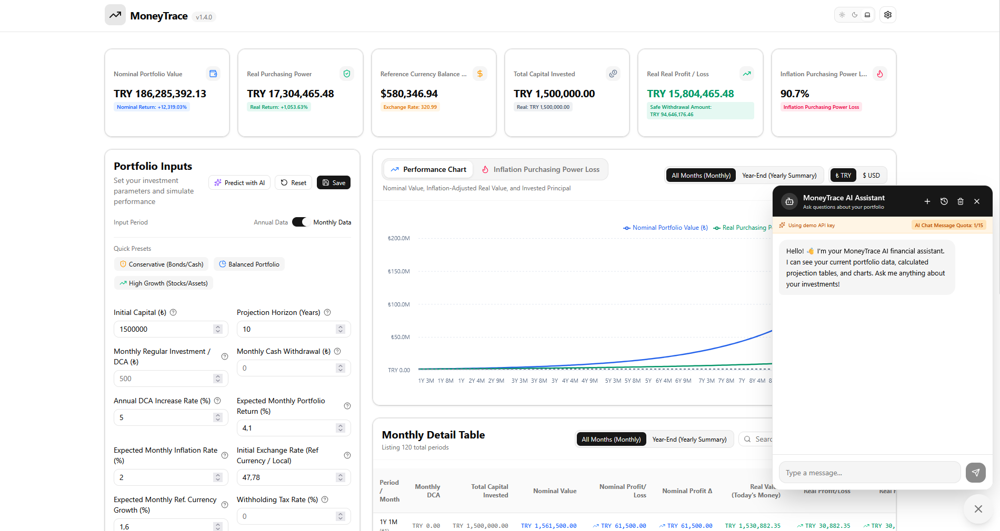
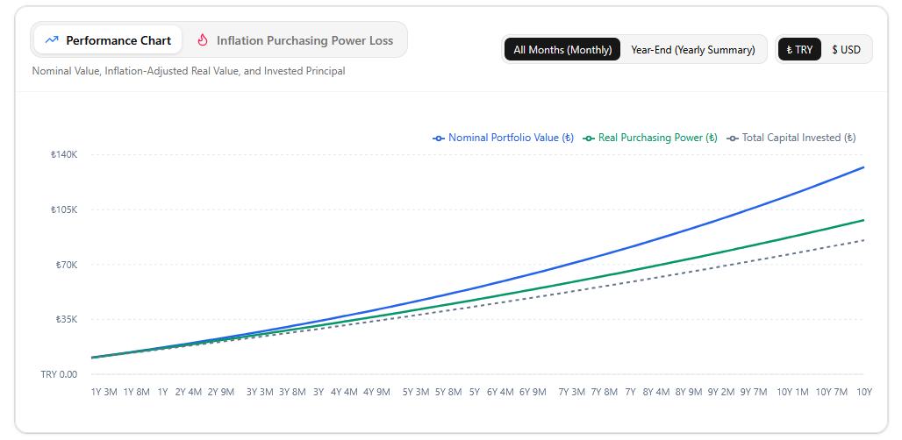
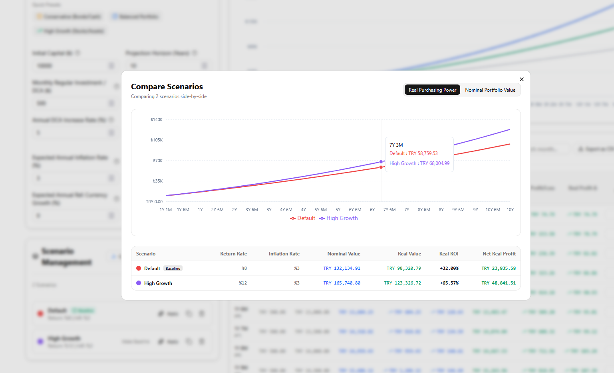
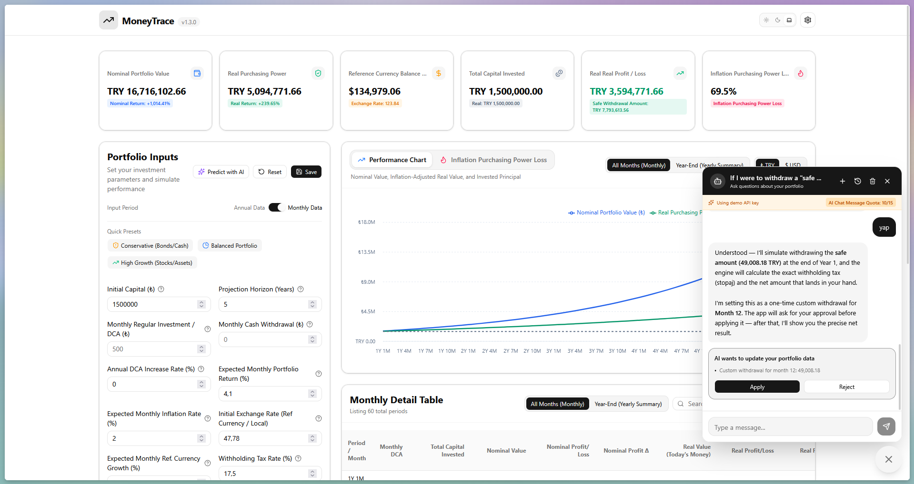
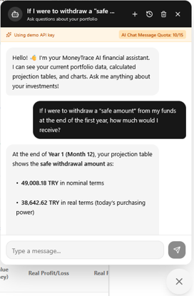
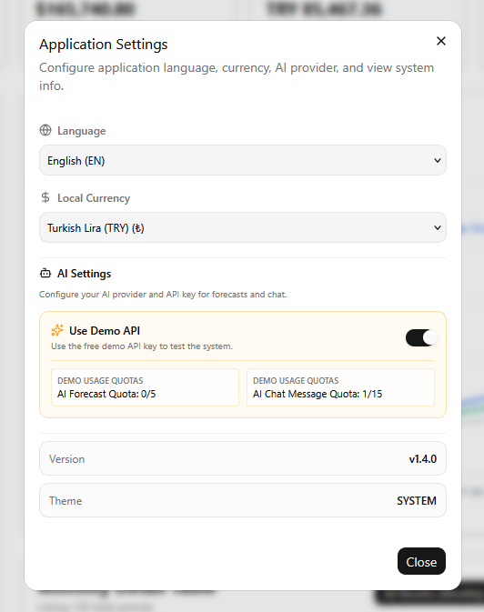

<p align="center">
  
</p>

<h1 align="center">MoneyTrace</h1>

<p align="center">
  <strong>See your money's real future — inflation-adjusted portfolio projection</strong>
</p>

<p align="center">
  <em>Compound growth & DCA simulation · Real vs. nominal value · AI financial assistant</em>
</p>

<p align="center">
  <a href="https://moneytrace.metee.com.tr">🌐 Live Demo</a> ·
  <a href="https://github.com/Metee01/MoneyTrace">GitHub</a>
</p>

<p align="center">
  
  
  
  
  
  
  
</p>

---

<!-- ⚠️ TODO: Add the app's main screenshot here (portfolio form + summary cards + projection table).
     Path: docs/screenshots/dashboard.png (recommended size: 1600x1000, dark theme) -->


---

## Why MoneyTrace?

Most financial calculators show you **nominal numbers** — big future balances that quietly lose their purchasing power to inflation. MoneyTrace computes the numbers in **today's money**, so you see not only *how much* you'll have, but *what it will actually buy*.

It's an open-source, privacy-first investment projection engine:

- **All calculations run in your browser** — no servers, no accounts, no tracking, no database. Your data never leaves your device.
- **Deterministic finance engine** — pure, testable math orchestrated in `src/engine/`; the UI only renders results.
- **AI that understands your portfolio** — an optional chat assistant and forecast tool that reads your actual projection context and answers real questions (e.g. *"What happens if I increase my DCA by 5% annually?"*).

## Features

| | |
| :--- | :--- |
| 📈 **Real vs. Nominal value** | Track both the raw balance and its inflation-adjusted purchasing power — two curves, one honest picture. |
| 💰 **Compound growth & DCA engine** | Simulate up to **50 years**: initial capital, monthly DCA, annual contribution increase, withdrawals, withholding tax, inflation. |
| 💱 **Multi-currency** | USD, EUR, GBP, JPY, TRY, BRL, INR and more, with automatic locale-aware number formatting. |
| 📊 **Reference currency tracking** | Benchmark local-currency portfolios against USD (or any reference) with projected FX growth. |
| 🤖 **AI Financial Assistant** | Floating chat widget that analyzes your active projection — returns, horizons, DCA variants — client-side context, full privacy. |
| ⚡ **AI Economic Forecasting** | One click to estimate inflation, returns, and exchange rates, and auto-fill your portfolio inputs. |
| 🔑 **Bring your own key** | Gemini, OpenAI, or any OpenAI-compatible API (OpenRouter, Groq, Ollama, LM Studio…). A hosted **Demo API** mode lets visitors try the AI for free, with server-enforced quotas. |
| 🎯 **Scenario management** | Create, clone, edit, compare, and pin baseline scenarios — pre-seeded with *Optimistic*, *Market Growth*, *Conservative*, and *Custom*. |
| 📊 **Interactive charts** | Portfolio growth (nominal vs. real vs. invested), reference-currency valuation, and inflation impact visualizations. |
| 📁 **Export & import** | CSV export of year- and month-level tables; JSON backup/restore of all scenarios. |
| 🌐 **i18n** | English and Turkish, switch seamlessly. |
| 🔒 **Privacy-first** | Zero tracking, zero accounts; Zustand `persist` keeps everything in `localStorage`. |

## Screenshots

<!-- Record the screenshots below into docs/screenshots/ — each one's expected path is noted. Once the files exist, this section renders as a gallery. -->

### 1. Dashboard

<!-- TODO: docs/screenshots/dashboard.png — desktop, dark theme, portfolio form on the left, summary cards + projection table on the right -->


**How:** Start with the default scenario, ~10 years, and capture the main view (portfolio form + summary cards + table).

### 2. Charts

<!-- TODO: docs/screenshots/charts.png — ChartSection with the three Recharts visualizations visible -->


**How:** Scroll to the chart section — growth vs. real balance vs. invested capital, reference currency line, and inflation impact card.

### 3. Scenario comparison

<!-- TODO: docs/screenshots/scenarios.png — ScenarioComparisonDialog with at least 3 scenarios side by side -->


**How:** Create 2–3 scenarios (e.g. *Market Growth* vs. *Conservative*), open **Compare** and capture the side-by-side table.

### 4. AI Forecast modal

<!-- TODO: docs/screenshots/ai-forecast.png — AiForecastModal with estimated parameters filled in -->


**How:** Open the **AI Forecast** modal, run a forecast, and capture the filled-in parameters.

### 5. AI Chat

<!-- TODO: docs/screenshots/ai-chat.png — chat widget with a Q&A session visible -->


**How:** Open the chat FAB (bottom-right), ask one of the question, and capture the conversation.

### 6. Settings

<!-- TODO: docs/screenshots/settings.png — Settings dialog with the AI provider tab open -->


**How:** Open the Settings dialog and capture the AI configuration (provider, key, model, base URL, Demo API toggle).

## Tech Stack

| Category | Choice |
| :--- | :--- |
| Frontend | React 19 · TypeScript · Vite 8 |
| Styling | Tailwind CSS v4 (`@tailwindcss/vite`) · `@base-ui/react` · CVA + `cn()` |
| State | Zustand + `persist` (`localStorage`) |
| Charts | Recharts |
| i18n | i18next · react-i18next |
| AI (client) | `src/lib/ai-service.ts` · `ai-chat-service.ts` — Gemini / OpenAI / OpenAI-compatible |
| Backend (optional) | Vercel Edge Function `api/demo.ts` + Upstash Redis quota counters |

## Getting Started

```bash
git clone https://github.com/Metee01/MoneyTrace.git
cd MoneyTrace
npm install
npm run dev      # → http://localhost:5173
```

Useful scripts:

| Script | Purpose |
| :--- | :--- |
| `npm run dev` | Start the Vite dev server |
| `npm run build` | Typecheck (`tsc -b`) + production build |
| `npm run lint` · `npm run format` | ESLint · Prettier |
| `npm test` | Deterministic engine + store + AI tools tests (via `tsx`) |

<details>
<summary><b>🔑 Environment variables & demo proxy</b> (for deploying your own instance)</summary>

| Variable | Where | Purpose |
| :--- | :--- | :--- |
| `VITE_DEMO_PROXY_URL` | `.env` / Vercel | Enables the hosted **Demo API** option; points at `/api/demo` |
| `DEMO_API_KEY` | Vercel **only** | Shared demo key — lives in the edge function, never ships in the bundle |

The proxy in `api/demo.ts` enforces per-user quotas (5 forecasts / 15 chat messages), per-IP daily caps, a 3s chat cooldown, and optional persistent counters via Upstash Redis — see `api/demo.ts` for details.

</details>

## Architecture

```
┌──────────────────────────────┐       ┌──────────────────────────────┐
│           Browser            │       │     Vercel (optional)        │
│  PortfolioForm → engine/     │  AI   │  /api/demo (Edge Function)   │
│  (pure, deterministic)       │ ───▶  │  • owns DEMO_API_KEY         │
│  Zustand persist (local)     │       │  • quota + rate limiting     │
│  AI service / chat (BYOK)    │       │  • Upstash Redis (optional)  │
└──────────────────────────────┘       └──────────────────────────────┘
         ▲ all financial math
         │ stays on device
```

- `src/engine/` — pure, framework-free financial math (compound growth, inflation adjustment, currency conversion), orchestrated by `calculateProjection`; deterministic, rounded to 2 decimals.
- `src/config/index.ts` — single source of truth (`APP_CONFIG`): app metadata, AI models, demo quotas, engine limits.
- UI components never compute financials themselves — they only consume the engine.

## Project Structure

```text
src/
├── components/       UI — portfolio form, projection cards/table/charts,
│                     scenarios, chat widget, layout
├── config/           APP_CONFIG — single source of truth (app, AI, engine)
├── engine/           Pure financial math (compound-growth, inflation-adjust, …)
├── lib/              AI services, demo-proxy client, formatters, export, i18n
├── store/            Zustand stores with persist (portfolio, settings)
├── locales/          en / tr translation dictionaries
└── types/            Shared TypeScript types
api/demo.ts           Vercel serverless Demo API proxy
```

## Contributing & License

Found a bug or have an idea? Open an issue or PR — [CONTRIBUTING.md](CONTRIBUTING.md) has the details.

Released under the [MIT License](LICENSE). Made for people who want to know the *real* price of their future 💸