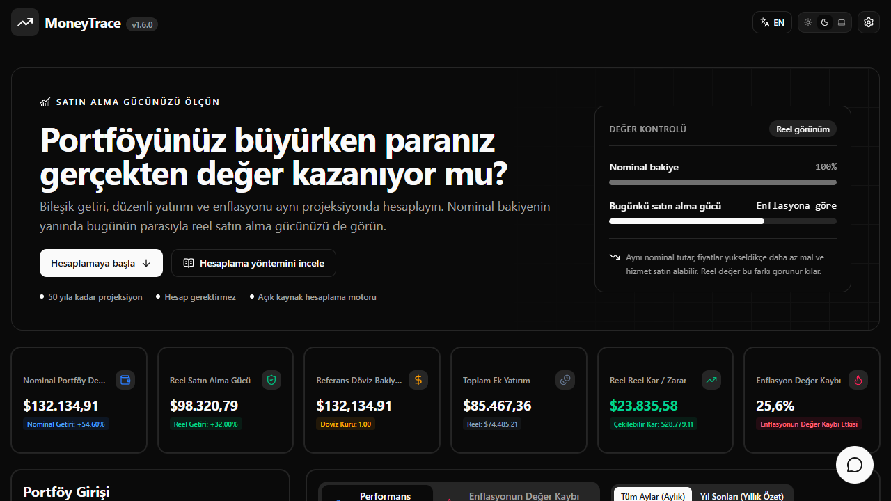
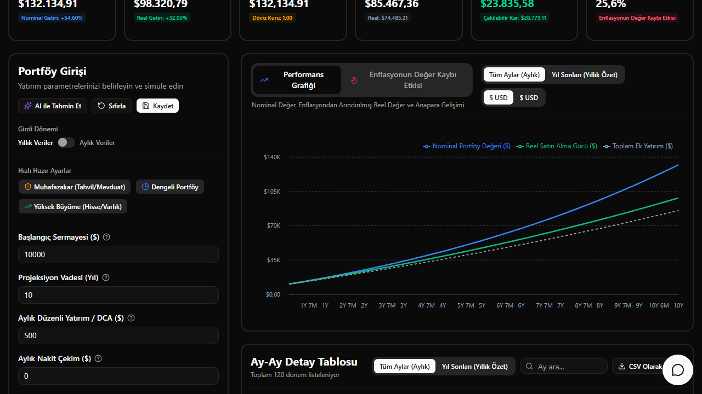
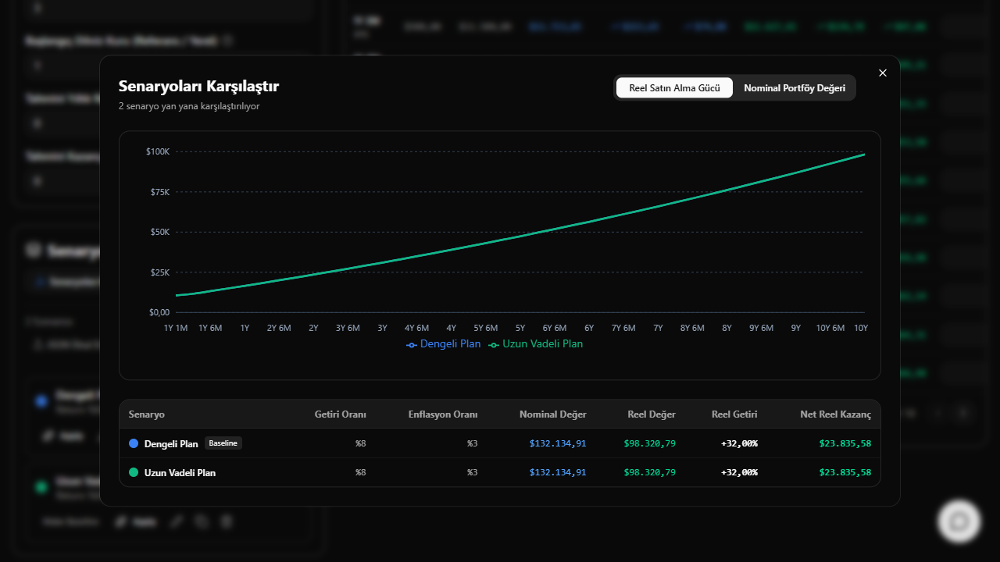
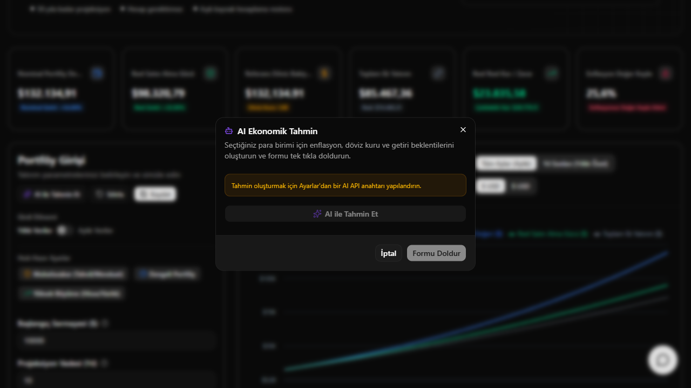
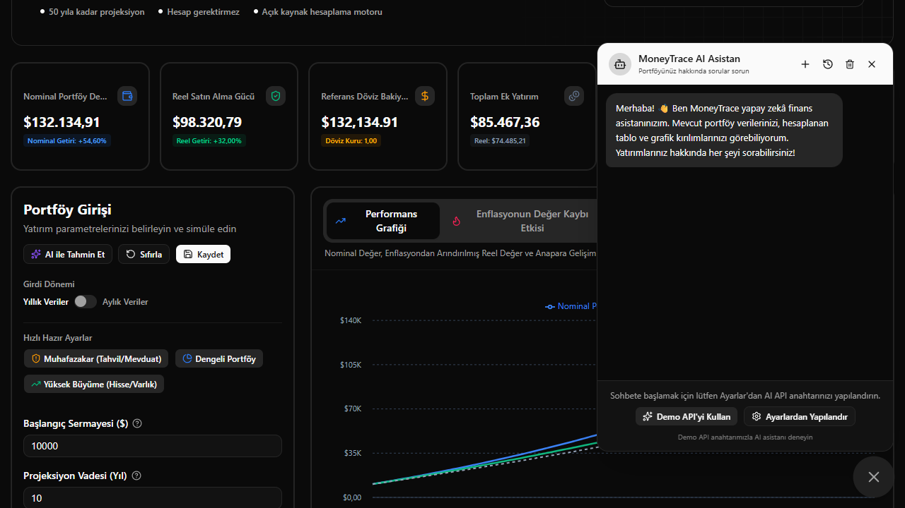
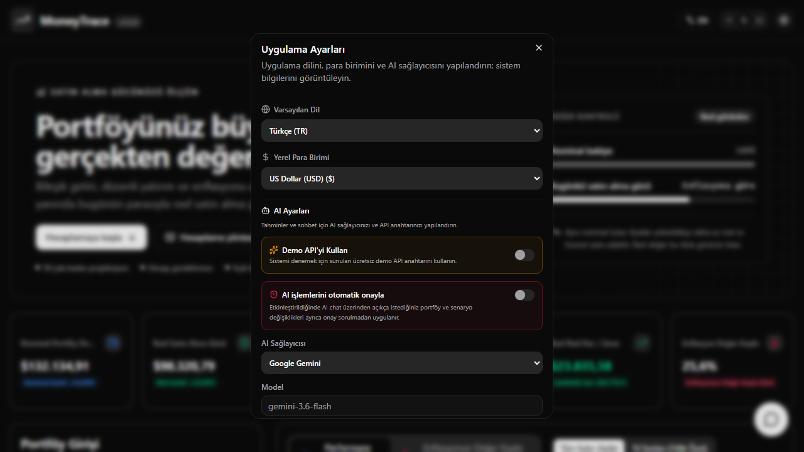

<p align="center">
  
</p>

<h1 align="center">MoneyTrace</h1>

<p align="center">
  <strong>Paranızın gerçek geleceğini görün — enflasyondan arındırılmış portföy projeksiyonu</strong>
</p>

<p align="center">
  <em>Bileşik büyüme ve DCA simülasyonu · Reel ve nominal değer · AI finansal asistan</em>
</p>

<p align="center">
  <a href="https://moneytrace.metee.com.tr">🌐 Canlı Demo</a> ·
  <a href="https://github.com/Metee01/MoneyTrace">GitHub</a>
</p>

<p align="center">
  
  
  
  
  
  
  
</p>

---



---

## Neden MoneyTrace?

Çoğu finansal hesaplayıcı size **nominal rakamlar** gösterir — enflasyon karşısında satın alma gücünü sessizce yitiren büyük gelecek bakiyeleri. MoneyTrace hesaplamaları **bugünün parasıyla** yapar; böylece sadece _ne kadarınızın olacağını_ değil, o paranın _gerçekte ne satın alacağını_ görürsünüz.

Açık kaynaklı, gizlilik öncelikli bir yatırım projeksiyon motoru:

- **Temel hesaplamalar tarayıcınızda çalışır** — hesap veya uygulama veritabanı gerekmez; portföy verileri yerel depolamada kalır. İsteğe bağlı AI istekleri, ilgili bağlamı seçtiğiniz sağlayıcıya veya demo proxy'sine gönderir.
- **Deterministik finans motoru** — `src/engine/` içinde saf, test edilebilir matematik; arayüz yalnızca sonuçları gösterir.
- **Portföyünüzü anlayan AI** — isteğe bağlı sohbet asistanı ve tahmin aracı, gerçek projeksiyon bağlamınızı okuyup gerçek soruları yanıtlar (örn. _"Yıllık DCA artışımı %5 yaparsam ne olur?"_).

## Özellikler

|                                     |                                                                                                                                                                                                   |
| :---------------------------------- | :------------------------------------------------------------------------------------------------------------------------------------------------------------------------------------------------ |
| 📈 **Reel ve nominal değer**        | Ham bakiyenin yanında enflasyona göre düzeltilmiş satın alma gücünü de izleyin — iki eğri, tek dürüst tablo.                                                                                      |
| 💰 **Bileşik büyüme ve DCA motoru** | **50 yıla** kadar simülasyon: başlangıç sermayesi, aylık DCA, yıllık katkı artışı, çekimler, tahmini kazanç vergisi, enflasyon.                                                                   |
| 💱 **Çoklu para birimi**            | USD, EUR, GBP, JPY, TRY, BRL, INR ve daha fazlası; otomatik, yerelleştirilmiş sayı biçimlendirme.                                                                                                 |
| 📊 **Referans para birimi takibi**  | Yerel para birimi portföylerini USD (veya herhangi bir referans) karşısında, öngörülen kur büyümesiyle değerlendirin.                                                                             |
| 🤖 **AI Finansal Asistan**          | Aktif projeksiyonunuzu analiz eden yüzen sohbet aracı — getiriler, ufuklar, DCA varyantları; bağlam yalnızca seçili AI sağlayıcısını kullandığınızda gönderilir.                                  |
| ⚡ **AI Ekonomik Tahmin**           | Tek tıkla enflasyon, getiri ve döviz kuru tahminleri; portföy girdilerinizi otomatik doldurun.                                                                                                    |
| 🔑 **Kendi anahtarını getir**       | Gemini, OpenAI veya herhangi bir OpenAI uyumlu API (OpenRouter, Groq, Ollama, LM Studio…). Hosted **Demo API** modu, ziyaretçilerin AI'yı ücretsiz denemesini sağlar; kotalar sunucuda uygulanır. |
| 🎯 **Senaryo yönetimi**             | Senaryolar oluşturun, kopyalayın, düzenleyin, karşılaştırın ve temel senaryo olarak sabitleyin — _İyimser_, _Piyasa Büyümesi_, _Muhafazakâr_ ve _Özel_ varsayılanlarıyla gelir.                   |
| 📊 **Etkileşimli grafikler**        | Portföy büyümesi (nominal vs. reel vs. yatırılan sermaye), referans para birimi değerlemesi ve enflasyon etkisi görselleştirmeleri.                                                               |
| 📁 **Dışa ve içe aktarma**          | Yıl ve ay düzeyinde tablolar için CSV dışa aktarma; tüm senaryolar için JSON yedekleme/geri yükleme.                                                                                              |
| 🌐 **i18n**                         | İngilizce ve Türkçe — anında geçiş.                                                                                                                                                               |
| 🔒 **Gizlilik öncelikli**           | Reklam takipçisi veya analitik çerezi yoktur; Vercel Web Analytics çerezsiz, toplu kullanım ölçümleri sağlar. Portföy verileri Zustand `persist` ile `localStorage` içinde kalır.                 |

## Ekran Görüntüleri

### 1. Ana Panel


**Nasıl çekilir:** Varsayılan senaryoyla başlayın (~10 yıl) ve ana görünümü yakalayın (portföy formu + özet kartlar + tablo).

### 2. Grafikler



**Nasıl çekilir:** Grafik bölümüne kaydırın — büyüme vs. reel bakiye vs. yatırılan sermaye, referans para birimi çizgisi ve enflasyon etkisi kartı.

### 3. Senaryo Karşılaştırma



**Nasıl çekilir:** 2–3 senaryo oluşturun (örn. _Piyasa Büyümesi_ vs. _Muhafazakâr_), **Karşılaştır**'ı açın ve yan yana tabloyu yakalayın.

### 4. AI Tahmin Modalı



**Nasıl çekilir:** **AI Tahmin** modalını açın, bir tahmin çalıştırın ve doldurulan parametreleri yakalayın.

### 5. AI Sohbet



**Nasıl çekilir:** Sohbet FAB'ını (sağ altta) açın, önerilen sorulardan birini sorun ve konuşmayı yakalayın.

### 6. Ayarlar



**Nasıl çekilir:** Ayarlar diyaloğunu açın ve AI yapılandırmasını yakalayın (sağlayıcı, anahtar, model, base URL, Demo API anahtarı).

## Teknoloji Yığını

| Kategori               | Seçim                                                                            |
| :--------------------- | :------------------------------------------------------------------------------- |
| Ön yüz                 | React 19 · TypeScript · Vite 8                                                   |
| Stil                   | Tailwind CSS v4 (`@tailwindcss/vite`) · `@base-ui/react` · CVA + `cn()`          |
| Durum                  | Zustand + `persist` (`localStorage`)                                             |
| Grafikler              | Recharts                                                                         |
| i18n                   | i18next · react-i18next                                                          |
| AI (istemci)           | `src/lib/ai-service.ts` · `ai-chat-service.ts` — Gemini / OpenAI / OpenAI uyumlu |
| Backend (isteğe bağlı) | Vercel Edge Function `api/demo.ts` + Upstash Redis kota sayaçları                |

## SEO ve Dil URL'leri

- Türkçe `/`, İngilizce `/en` üzerinden sunulur. Bilgi ve yasal sayfaların dile özel karşılıkları ve karşılıklı `hreflang` bağlantıları vardır.
- `npm run build` tüm genel rotaları statik olarak üretir; sayfa bazlı metadata ve JSON-LD, `sitemap.xml`, `robots.txt` ve `404.html` oluşturur, ardından SEO çıktısını doğrular.
- Canonical üretim adresi `https://moneytrace.metee.com.tr` olup `APP_CONFIG.app.siteUrl` içinde yönetilir.
- Sosyal önizlemeler `public/og-image-{tr,en}.png` altındaki 1200×630 dile özel görselleri kullanır.

## Hızlı Başlangıç

```bash
git clone https://github.com/Metee01/MoneyTrace.git
cd MoneyTrace
npm install
npm run dev      # → http://localhost:5173
```

Kullanışlı komutlar:

| Komut                             | Amaç                                                                        |
| :-------------------------------- | :-------------------------------------------------------------------------- |
| `npm run dev`                     | Vite geliştirme sunucusunu başlatır                                         |
| `npm run build`                   | Tip kontrolü, prodüksiyon derlemesi, statik rota üretimi ve SEO doğrulaması |
| `npm run lint` · `npm run format` | ESLint · Prettier                                                           |
| `npm test`                        | Deterministik motor + store + AI araç testleri (`tsx` ile)                  |

<details>
<summary><b>🔑 Ortam değişkenleri ve demo proxy</b> (kendi örneğinizi dağıtmak için)</summary>

| Değişken              | Nerede          | Amaç                                                                        |
| :-------------------- | :-------------- | :-------------------------------------------------------------------------- |
| `VITE_DEMO_PROXY_URL` | `.env` / Vercel | Hosted **Demo API** seçeneğini etkinleştirir; `/api/demo` adresini gösterir |
| `DEMO_API_KEY`        | Yalnızca Vercel | Paylaşılan demo anahtarı — edge fonksiyonunda yaşar, bundle'a asla girmez   |

`api/demo.ts` içindeki proxy; kullanıcı başına kotaları (5 tahmin / 15 chat mesajı), IP başına günlük limitleri, 3 saniyelik chat cooldown'ını ve Upstash Redis ile isteğe bağlı kalıcı sayaçları uygular — ayrıntılar için `api/demo.ts` dosyasına bakın.

</details>

## Mimari

```
┌──────────────────────────────┐       ┌──────────────────────────────┐
│           Tarayıcı            │       │     Vercel (isteğe bağlı)    │
│  PortfolioForm → engine/     │  AI   │  /api/demo (Edge Function)   │
│  (saf, deterministik)        │ ───▶  │  • DEMO_API_KEY'e sahiptir   │
│  Zustand persist (yerel)     │       │  • kota + hız sınırlama      │
│  AI servis / sohbet (BYOK)   │       │  • Upstash Redis (isteğe    │
└──────────────────────────────┘       │    bağlı)                    │
         ▲ tüm finansal hesaplar       └──────────────────────────────┘
         │ cihazda kalır
```

- `src/engine/` — saf, çerçevesiz finansal matematik (bileşik büyüme, enflasyon düzeltmesi, kur çevirimi); `calculateProjection` tarafından yönetilir; deterministik, 2 ondalığa yuvarlanır.
- `src/config/index.ts` — tek doğruluk kaynağı (`APP_CONFIG`): uygulama meta verileri, AI modelleri, demo kotaları, motor limitleri.
- UI bileşenleri finansal hesaplama yapmaz — yalnızca motorun sonuçlarını tüketir.

## Proje Yapısı

```text
src/
├── components/       UI — portföy formu, projeksiyon kartları/tablo/grafik,
│                     senaryolar, sohbet widget'ı, yerleşim
├── config/           APP_CONFIG — tek doğruluk kaynağı (app, AI, engine)
├── engine/           Saf finansal matematik (compound-growth, inflation-adjust, …)
├── lib/              AI servisleri, demo-proxy istemcisi, biçimlendiriciler, dışa aktarma, i18n
├── store/            persist'li Zustand depoları (portfolio, settings)
├── locales/          en / tr çeviri sözlükleri
├── seo/              canonical rotalar, metadata ve tarayıcı head senkronizasyonu
└── types/            Paylaşılan TypeScript tipleri
api/demo.ts           Vercel sunucusuz Demo API proxy'si
scripts/              Statik sayfa üretimi ve SEO doğrulaması
```

## Katkı ve Lisans

Bir hata buldunuz veya bir fikriniz mi var? Issue veya PR açın — ayrıntılar [CONTRIBUTING.md](CONTRIBUTING.md) içinde.

Proje [MIT Lisansı](LICENSE) ile lisanslanmıştır. Geleceğinizin _gerçek_ fiyatını bilmek isteyenler için yapıldı 💸
